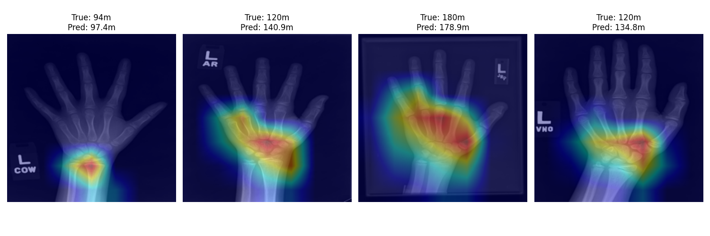

# Bone Age Prediction from Hand Radiographs

## Abstract
Bone age assessment is a fundamental diagnostic procedure in pediatric radiology, essential for evaluating growth disorders, endocrine abnormalities, and developmental delays. Traditional methods like the Greulich-Pyle atlas are subjective and time-consuming. This project presents an automated deep learning pipeline using the **RSNA Pediatric Bone Age Dataset** to predict bone age with high accuracy. By leveraging a **ResNet-18** architecture, the model provides a consistent and objective alternative to manual inspection.

## Key Results
The model was evaluated on an independent test set of 1,892 samples.

| Metric | Performance |
| :--- | :--- |
| **Mean Absolute Error (MAE)** | **11.33 months** |
| **RMSE** | 14.48 months |
| **R² Score** | 0.87 |
| **Classification Accuracy** | 86.31% (Developmental Stages) |

## Technologies & Dependencies
* **Python 3.8+**
* **PyTorch** (Deep Learning Framework)
* **Torchvision** (Model Architecture & Transforms)
* **Pandas & NumPy** (Data Manipulation)
* **Matplotlib & Seaborn** (Visualization)
* **OpenCV (cv2)** (Image Processing)
  
## Methodology

### 1. Dataset Description
The project utilizes the [**RSNA Pediatric Bone Age Dataset**](https://www.kaggle.com/datasets/kmader/rsna-bone-age), containing over 12,000 hand radiographs annotated with bone age (in months) and gender.
* **Training Set:** 8,827 images 
* **Validation Set:** 1,892 images
* **Test Set:** 1,892 images

### 2. Preprocessing Pipeline
To standardize inputs for the network, the following preprocessing steps were applied:
* **Resizing:** Images scaled to 256×256.
* **Cropping:** Center crop to 224×224.
* **Normalization:** Pixel intensities normalized using ImageNet statistics.
* **Augmentation:** Random rotation of ±10° applied during training.

### 3. Model Architecture
We employed a **ResNet-18** backbone pretrained on ImageNet. The architecture includes:
* **Residual Connections:** To mitigate vanishing gradients.
* **Regression Head:** The final classification layer was replaced with a single neuron to predict age in months.

### 4. Training Configuration
* **Optimizer:** Adam (Learning Rate: 0.001).
* **Loss Function:** MSE Loss.
* **Batch Size:** 32.
* **Epochs:** 5.

## Repository Structure
 ```text
 ├── docs/        # Project Report (PDF)
 ├── models/       # Trained .pth model weights
 ├── Results/      # Output plots (Confusion Matrix, Loss Curves, Grad-CAM)
 ├── src/        # Source code
 │  ├── Data_setup_and_EDA.py  # Data loading and exploration
 │  ├── Dataset_Resize.py    # Image pre-processing
 │  ├── Get_reg_results.py    # Regression evaluation script
 │  ├── confusion_Matrix.py   # Classification analysis script
 │  └── Grad-CAM_Visulization.py # Explainability visualization
 └── README.md
 ```
## Analysis & Explainability

### Gender Bias
We observed an MAE of **9.86 months for males** versus **13.06 months for females**. This discrepancy is attributed to higher skeletal variability during female puberty.

### Developmental Stage Classification
The model achieved **86.31% accuracy** when classifying subjects into Child, Adolescent, and Adult stages.
* **Child Precision:** 0.88
* **Adolescent Precision:** 0.84

### Grad-CAM Visualization
Gradient-weighted Class Activation Mapping (Grad-CAM) was used to visualize model focus. The network correctly identified anatomical landmarks such as **carpal bones, metaphyseal regions, and epiphyseal plates**, confirming clinical interpretability.



## Future Work
* **Gender Integration:** Incorporating gender as an auxiliary input to reduce bias.
* **Advanced Architectures:** Exploring Vision Transformers (ViT).
* **Segmentation:** Integrating bone-level segmentation for finer anatomical reasoning.

## Project Team
**Institution:** IIITDM Kancheepuram, Department of Computer Science and Engineering
**Faculty Advisor:** **Dr. Umarani**   
**Student Team:**
* **P. Srikala** - CS23B2049
* **N. Ravi Tejesh** - CS23B2051
* **N. Durga Prasad** - CS23B2052
